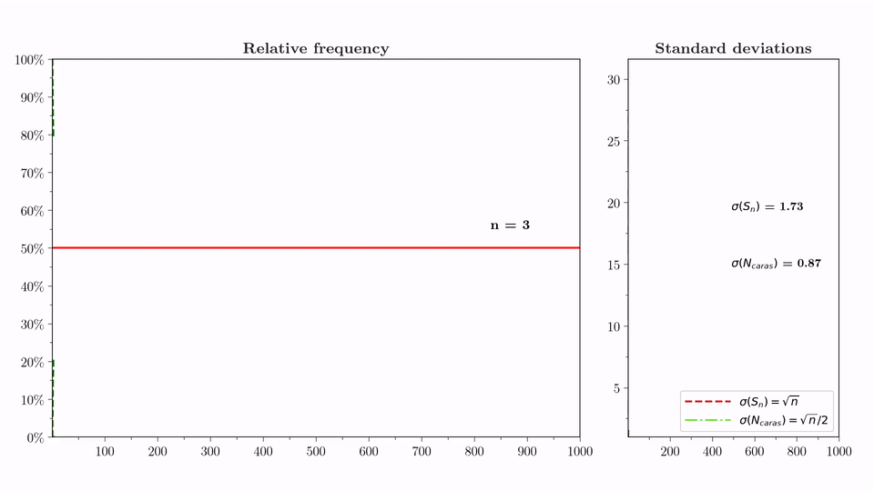
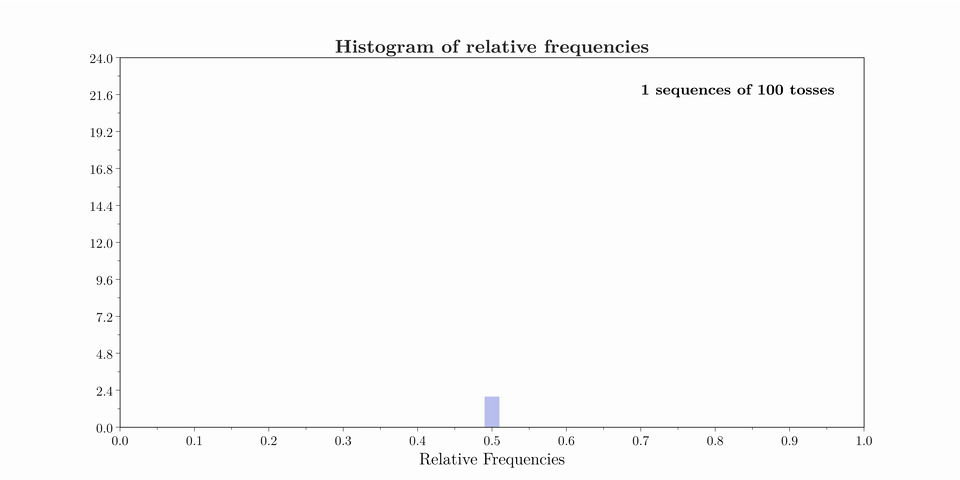

# Educational Coin Toss Simulations

Python animations designed to support the teaching of fundamental concepts in probability through interactive visualizations.

This repository contains two animations that illustrate:

1. the convergence of the cumulative relative frequency of heads toward the theoretical probability predicted by the Law of Large Numbers;

2. the distribution of the relative frequency of heads obtained from repeated sequences of fair-coin tosses and its convergence toward the normal approximation predicted by the Central Limit Theorem.


## Educational Areas
- Mathematics Education
- Probability
- Statistics

## Preview

### Relative frequency analysis

<p align="center">
  
</p>

### Histogram of relative frequencies

<p align="center">
  
</p>


## Description

### The first animation illustrates

### The first animation illustrates

- cumulative relative frequency;
- expected value;
- theoretical ±1σ confidence bands;
- growth of σ(Sₙ) = √n;
- growth of σ(N_heads) = √n/2;
- convergence predicted by the Law of Large Numbers.

### The second animation illustrates

- the histogram of relative frequencies;
- the normal approximation;
- the standard deviation of the relative frequency;
- convergence predicted by the Central Limit Theorem.


## Educational objectives
These animations were developed as educational resources for introductory courses in Probability and Statistics.

**Target audience**

- undergraduate students
- high-school students
- high-school teachers

## Mathematical background
- Probability
- Relative frequency
- Expected value
- Standard deviation
- Law of Large Numbers
- Central Limit Theorem

## Demonstration

- Relative frequency animation: [relative_frequency.mp4](media/relative_frequency.mp4)
- Histogram animation: [histogram.mp4](media/histogram.mp4)

## Requirements

- Python 3.12 or later
- NumPy 2.4.6 or later
- Matplotlib 3.11.0 or later

## Run

Each animation can be executed independently:

```bash
python coin_frequency.py
```

```bash
python coin_histogram.py
```

## More details
A detailed mathematical discussion will be available in a future version of the repository.

## License

MIT License


---

## Author

Anderson Ribeiro

GitHub: <https://github.com/andersonribeiro2026>